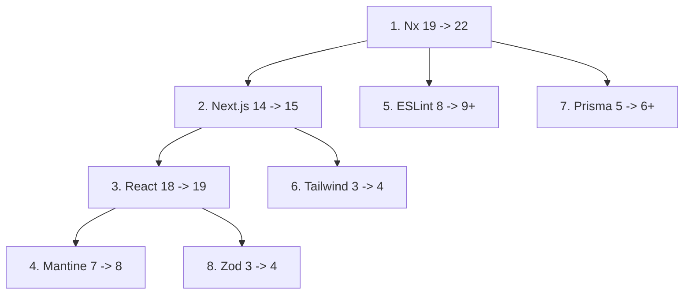

# Dependency Upgrade Review

## Current State

Nx monorepo with a Next.js web app (`daily-questions`), Playwright E2E suite, and a Flutter iOS app. All npm deps managed at root [package.json](package.json). Dockerfile uses `node:20-alpine`. Notable mismatch: `@types/node` is pinned to `18.16.9`.

---

## Tier 1: Safe Upgrades (No Regression Risk)

Patch and minor bumps following semver. Can be applied immediately with a quick `build + lint + test` verification.

### Patch bumps (bug fixes only)

- `autoprefixer` 10.4.13 -> 10.4.27
- `bull` ^4.16.4 -> ^4.16.5
- `dayjs` ^1.11.13 -> ^1.11.19
- `react-swipeable` ^7.0.1 -> ^7.0.2
- `ts-node` ^10.9.1 -> ^10.9.2
- `@swc/helpers` ~0.5.11 -> ~0.5.19

### Minor bumps (new features, backwards-compatible)

- `@auth/prisma-adapter` ^2.4.2 -> ^2.11.1
- `@bull-board/api` + `@bull-board/express` ^6.3.3 -> ^6.20.3
- `@dnd-kit/core` ^6.1.0 -> ^6.3.1
- `@serwist/next` + `serwist` ^9.0.9 -> ^9.5.6
- `@tabler/icons-react` ^3.12.0 -> ^3.37.1
- `@testing-library/react` ^16.0.0 -> ^16.3.2
- `@vercel/analytics` ^1.3.1 -> ^1.6.1
- `@vercel/speed-insights` ^1.0.13 -> ^1.3.1
- `csv-parser` ^3.0.0 -> ^3.2.0
- `ioredis` ^5.4.1 -> ^5.9.3
- `mantine-form-zod-resolver` ^1.1.0 -> ^1.3.0
- `postcss` ^8.4.38 -> ^8.5.6
- `postcss-preset-mantine` ^1.17.0 -> ^1.18.0
- `posthog-js` ^1.187.2 -> ^1.356.0
- `react-hook-form` ^7.53.0 -> ^7.71.2
- `tslib` ^2.3.0 -> ^2.8.1
- `ts-jest` ^29.1.0 -> ^29.4.6
- `@swc-node/register` ~1.9.1 -> ~1.11.1
- `@swc/core` ~1.5.7 -> ~1.15.13

### Dev tooling minor bumps

- `eslint-plugin-import` 2.27.5 -> 2.32.0
- `eslint-plugin-jsx-a11y` 6.7.1 -> 6.10.2
- `eslint-plugin-react` 7.32.2 -> 7.37.5
- `@playwright/test` ^1.36.0 -> ^1.58.2

**Recommendation:** Apply all of these in a single PR. Run `nx run-many -t build,lint,test` to verify.

---

## Tier 2: Low-Risk Upgrades (Minor Code Changes Likely)

### TypeScript 5.5 -> 5.9

- Generally safe; new strictness checks may surface a handful of type errors
- No API breakage expected

### `@types/node` 18.16.9 -> 20.x (not 25.x)

- Currently mismatched with Dockerfile (`node:20-alpine`). Should align to `@types/node@^20`
- Going to 25.x would be premature since the runtime is Node 20

### `prettier` ^2.6.2 -> ^3.x

- Formatting-only changes; will reformat files but no runtime impact
- Trailing commas become default, semicolons change slightly
- Run `prettier --write .` after upgrade and commit reformatted files

### `sharp` ^0.33.5 -> ^0.34.5

- Image processing library; 0.34 is a minor bump in 0.x semver
- Check release notes but generally safe for basic resize/optimize usage

### `bcryptjs` ^2.4.3 -> ^3.0.3

- Pure JS bcrypt implementation; v3 drops Node <18 support (not a concern on Node 20)
- API is identical

### `dotenv-cli` ^7.4.2 -> ^11.0.0

- CLI tool only used in dev scripts; low risk

**Recommendation:** Apply in a second PR after Tier 1. Requires `lint --fix` and `prettier --write` pass.

---

## Tier 3: Medium-Risk Upgrades (Require Testing)

### `embla-carousel-react` 7 -> 8

- API changes in carousel hook signatures; affects `@mantine/carousel` integration
- Should be done alongside Mantine upgrade (Mantine 8 likely expects embla 8)

### `recharts` 2 -> 3

- Chart component API changes; review any custom chart configurations in the app
- Moderate effort to migrate

### `@react-email/components` 0.0.31 -> 1.0.8 and `@react-email/render` 1 -> 2

- Email templates may need updating; test email rendering
- `react-email` dev tool 3.0.4 -> 5.2.8

### `resend` ^4.0.1 -> ^6.9.2

- Email sending API; check for breaking changes in send() method signature

### `@hookform/resolvers` ^3.9.0 -> ^5.2.2

- Resolver API changes; affects form validation integration with zod

### `@dnd-kit/sortable` ^8.0.0 -> ^10.0.0

- Drag-and-drop sortable API changes; review question reordering feature

**Recommendation:** Each of these should be its own small PR with focused testing on the affected feature.

---

## Tier 4: High-Risk Upgrades (Major Effort, Do NOT Bundle)

These are ecosystem-wide upgrades that cascade into many other changes. Each requires its own dedicated branch and thorough testing.

### 4a. Nx 19 -> 22

- **Effort:** Medium
- **Risk:** Build pipeline changes, plugin API updates, possible config migration
- **Approach:** Use `nx migrate latest` which generates a migrations.json and applies codemods
- **Do first** since Nx is the build orchestrator; other upgrades benefit from latest tooling

### 4b. Next.js 14 -> 15 (not 16 yet)

- **Effort:** High
- **Risk:** App Router API changes, async request APIs (`cookies()`, `headers()` become async), middleware changes
- **Dependencies:** Must stay on React 18 if going to Next 15, or move to React 19 simultaneously
- **Also bumps:** `eslint-config-next`, `@next/bundle-analyzer`
- **Recommendation:** Go to 15 first, stabilize, then consider 16

### 4c. React 18 -> 19

- **Effort:** High
- **Risk:** `forwardRef` deprecated, `ref` as prop, `useContext` replaced by `use()`, string refs removed
- **Dependencies:** Mantine 8 requires React 19. All `@types/react` and `@types/react-dom` must match.
- **Recommendation:** Only do this when ready to also upgrade Mantine to v8

### 4d. Mantine 7 -> 8

- **Effort:** High
- **Risk:** Component API changes, style system changes, some components renamed/restructured
- **Dependencies:** Requires React 19, which requires Next.js 15+
- **Cascade:** All 10 `@mantine/` packages must move together + `postcss-preset-mantine`

### 4e. Prisma 5 -> 6/7

- **Effort:** Medium-High
- **Risk:** Query engine changes, possible schema syntax changes, migration format changes
- **Dependencies:** `@prisma/client`, `prisma`, `@auth/prisma-adapter`, `@prisma/nextjs-monorepo-workaround-plugin`
- **Note:** The monorepo workaround plugin may no longer be needed in Prisma 6+

### 4f. ESLint 8 -> 9/10 + Flat Config

- **Effort:** Medium
- **Risk:** Requires migration from `.eslintrc` to `eslint.config.js` flat config
- **Dependencies:** All `eslint-plugin-`_, `@typescript-eslint/`_, `@nx/eslint`
- **Recommendation:** Wait until Nx 22 upgrade is done (Nx 22 has better flat config support)

### 4g. Tailwind CSS 3 -> 4

- **Effort:** Medium
- **Risk:** Utility class changes, config format changes, PostCSS plugin changes
- **Note:** Tailwind 4 has a fundamentally different architecture (CSS-first config)

### 4h. Zod 3 -> 4

- **Effort:** Medium
- **Risk:** Schema API changes affect all form validations and API input parsing
- **Dependencies:** `@hookform/resolvers`, `mantine-form-zod-resolver`

---

## Tier 4 Recommended Upgrade Order

If pursuing major upgrades, the dependency chain dictates this order:

---

## Misc Issues Found

- `**next-auth` is on `^5.0.0-beta.25**` -- NextAuth v5 has since reached stable release. Upgrading to the stable v5 release is recommended (low risk, mostly re-exports stabilized).
- `**@types/node` version mismatch -- Pinned at 18.16.9 but Dockerfile uses Node 20. Should be `@types/node@^20`.
- `**@react-email/components` at exact `0.0.31` -- No caret/tilde, so it never auto-updates. The package has since reached 1.0 stability.

## Flutter App (`daily_questions_ios`)

- `webview_flutter` ^4.10.0 -- latest is 4.x (up to date)
- `firebase_core` ^3.8.1 and `firebase_messaging` ^15.1.6 -- check for minor bumps
- `flutter_lints` ^6.0.0 -- consider migrating to `flutter_lints` latest or the newer `lints` package
- Flutter SDK constraint `^3.10.7` -- appears current

**Low regression risk** for the Flutter app; it's a simple WebView wrapper.

---

## Recommended Action Plan

1. **Now:** Apply all Tier 1 (safe) upgrades in one PR
2. **Next:** Apply Tier 2 (low-risk) upgrades in a follow-up PR
3. **Individually:** Tackle Tier 3 items as small focused PRs
4. **Plan separately:** Tier 4 major upgrades should each be a dedicated effort with its own branch, following the dependency order above
