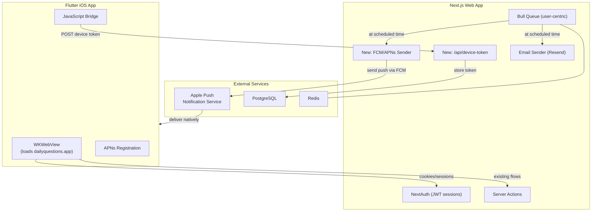

# iOS WebView App with Native Push Notifications

## Current Architecture

The app is a **Next.js 14 App Router** full-stack app deployed on Vercel at `dailyquestions.app`:

- **Frontend**: Server Components + Client Components with Mantine UI, already mobile-responsive
- **Backend**: Server Actions + API routes, PostgreSQL (Prisma), NextAuth v5 (JWT sessions)
- **Notifications**: Bull/Redis queue -> Web Push via VAPID -> service worker time-filtering. Unreliable on iOS.
- **PWA**: Serwist service worker, manifest, installable

## Strategy

1. **Remove** all web push notification code from the web app (VAPID, web-push, PushSubscription, service worker push handling)
2. **Keep** email notifications as the only notification channel for web users
3. **Add** native APNs push via a new Flutter iOS app that wraps the existing web app
4. **Keep** everything else (database, auth, UI, email notifications, PWA caching) unchanged

## Architecture After Changes



## Part 1: Remove Web Push from the Web App

The web push system touches these files. All web push code is removed; email notifications and PWA caching stay.

### Files to modify

- `**src/lib/actions.ts**` -- Remove `import webpush`, `webpush.setVapidDetails(...)`, and these server actions:
  - `subscribeUser()` (lines ~517-562)
  - `unsubscribeUser()` (lines ~566-615)
  - `getSubscriptions()` (lines ~618-640)
  - `sendNotification()` (lines ~898-950)
  - `updateSubscriptionTimezone()` (lines ~853-895)
  - Keep `scheduleNotification()` but refactor it to only update `user.notificationTime` and reschedule the user-centric Bull job (no more per-subscription jobs)
- `**src/lib/queue.ts**` -- Remove all `webpush.sendNotification()` calls. The queue becomes user-centric: one cron job per user that sends to device tokens (APNs) and email. Remove `PushSubscription` queries.
- `**src/app/sw.ts**` -- Remove the `push` event listener and `notificationclick` listener. Keep Serwist precaching and runtime caching (PWA offline still works).
- `**src/components/Profile/PushNotifications.tsx**` -- Delete this file entirely.
- `**src/components/Profile/ProfileDetails.tsx**` -- Remove `PushNotificationManager` import and usage (line 290). Remove `scheduleNotification` from the notification time handler (notification time is now saved via `updateUserDetails` or a simpler action). Keep the `TimeInput` for notification time and `EmailNotifications` component.
- `**src/app/profile/page.tsx**` -- Remove `pushSubscriptions: true` from the Prisma include (line 37).
- `**src/components/Home/InternalHome.tsx**` -- Remove the `pushSubscription` query (lines 19-21) and the "enable push notifications" prompt (lines 44-54). Replace with a prompt about email notifications or the iOS app.
- `**src/components/Admin/Admin.tsx**` and `**AdminTable.tsx**` -- Remove `PushSubscription` references from admin interfaces.
- `**package.json**` -- Remove `web-push` dependency. Keep `@serwist/next` and `serwist` (still needed for PWA caching).

### Files to delete

- `src/components/Profile/PushNotifications.tsx`

## Part 2: Backend -- New Device Token Model

### Prisma schema changes in `prisma/schema.prisma`

Add new model:

```prisma
model DeviceToken {
  id        String   @id @default(cuid())
  token     String   @unique
  platform  String   // "ios" or "android"
  userId    String
  timezone  String   @default("Europe/Amsterdam")
  user      User     @relation(fields: [userId], references: [id], onDelete: Cascade)
  createdAt DateTime @default(now())
  updatedAt DateTime @updatedAt

  @@index([userId])
  @@map("device_tokens")
}
```

Add to `User` model: `deviceTokens DeviceToken[]`

Keep the `PushSubscription` model in schema for now (avoids destructive migration) but stop querying it. Can be removed in a future cleanup migration.

## Part 3: Refactor Bull Notification Queue

Current: one cron job per `PushSubscription`, sends web push.

New: one cron job per `User` (keyed on `userId`), fires at user's `notificationTime` in their `timezone`. When it fires:

1. Check if user already submitted today
2. Query `DeviceToken` for the user -> send via FCM/APNs
3. Email sending stays in the separate `emailQueue` (already user-centric)

Key changes in `src/lib/queue.ts`:

- `scheduleUserNotification(userId, timeString, timezone)` -- simplified signature, no subscription ID
- Job data: `{ userId, timezone }`
- Processor: query `DeviceToken` table, send via `firebase-admin` FCM

## Part 4: New API Endpoint for Device Tokens

Create `src/app/api/device-token/route.ts`:

- **POST** `{ token, platform, timezone }` -- Requires auth session. Upserts token in `DeviceToken`. Returns success.
- **DELETE** `{ token }` -- Requires auth session. Deletes token. Returns success.

This is called by the Flutter app after obtaining the FCM token.

## Part 5: FCM/APNs Server-Side Sending

New file `src/lib/fcm.ts`:

- Initialize `firebase-admin` with service account credentials
- Export `sendPushToUser(userId)` that queries device tokens and calls `admin.messaging().send()` for each

**New dependency**: `firebase-admin`

**New env vars**:

- `FIREBASE_PROJECT_ID`
- `FIREBASE_CLIENT_EMAIL`
- `FIREBASE_PRIVATE_KEY`

## Part 6: Flutter iOS App

Create `apps/daily-questions-ios/` as a new Flutter project.

### Core structure

```
apps/daily-questions-ios/
  lib/
    main.dart              # App entry, FCM init, WebView
    services/
      push_service.dart    # FCM token management, permission requests
      auth_bridge.dart     # JS bridge to detect login/logout in WebView
  ios/
    Runner/
      GoogleService-Info.plist   # Firebase config
      Info.plist                  # Push entitlements
```

### Key behaviors

1. **WebView** -- `webview_flutter` loads `https://dailyquestions.app`. Cookies persist in WKWebView, so NextAuth sessions work without changes.
2. **Push registration flow**:

- App starts -> request notification permission
- Get FCM token via `firebase_messaging`
- Monitor WebView URL / inject JS to detect when user is logged in
- POST token to `/api/device-token` with auth cookie from WebView
- On token refresh, re-POST

1. **JS Bridge** -- Inject JavaScript to read auth state:

- Check if URL is a protected route (means user is logged in)
- Or inject `window.postMessage` calls from the web app to signal login/logout
- On logout detected, DELETE the device token

1. **Notification tap** -- `firebase_messaging` `onMessageOpenedApp` callback navigates WebView to `/submission/new`
2. **Splash screen** -- Native Flutter splash while WebView loads

### Flutter dependencies

- `webview_flutter: ^4.x`
- `firebase_core: ^3.x`
- `firebase_messaging: ^15.x`

## Part 7: Firebase / APNs Setup (manual steps)

1. Create Firebase project (free tier)
2. Add iOS app in Firebase console (bundle ID: `app.dailyquestions.ios` or similar)
3. Download `GoogleService-Info.plist` into Flutter iOS runner
4. In Apple Developer portal: create App ID with Push Notifications capability
5. Generate APNs Authentication Key (.p8), upload to Firebase Cloud Messaging settings
6. Generate Firebase service account key, add credentials to Vercel env vars
7. Add env vars to `.env`: `FIREBASE_PROJECT_ID`, `FIREBASE_CLIENT_EMAIL`, `FIREBASE_PRIVATE_KEY`

## Part 8: App Store Submission (manual steps)

- Apple Developer Program membership ($99/year)
- App icons: adapt existing `apple-touch-icon.png` to 1024x1024
- Screenshots: required for each supported device size
- Privacy policy: required (the app collects email, push tokens)
- App Review: native push notifications provide genuine native value beyond a simple wrapper

## What Stays Unchanged

- PostgreSQL database and all existing data
- User accounts and authentication (NextAuth JWT sessions work in WKWebView)
- All Server Actions and data logic (questions, submissions, answers)
- The entire Mantine UI and all pages/routes
- Email notifications (Resend) -- this becomes the only web notification channel
- PWA caching/offline support (Serwist service worker stays, minus push)
- Vercel deployment

## What Gets Removed

- `web-push` npm package and all VAPID configuration
- `PushNotificationManager` component and all Web Push subscription UI
- Service worker push/notification event handlers
- Bull queue web-push sending logic
- `PushSubscription` usage in queries (table stays in DB for now)
- `NEXT_PUBLIC_VAPID_PUBLIC_KEY` and `VAPID_PRIVATE_KEY` env vars (can be removed from Vercel)

## Risk: Apple App Review

Apple has historically rejected "thin wrapper" apps. Mitigations:

- Native push notifications provide genuine native functionality
- The app is a personal productivity tool, not a generic website
- Add a native splash/onboarding screen
- If rejected, fallback is to add more native screens (login, profile)
